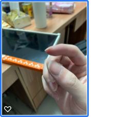
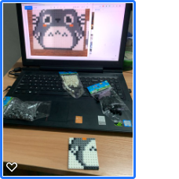
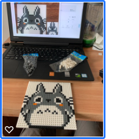
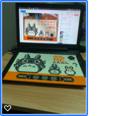
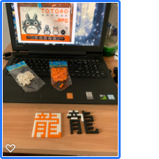
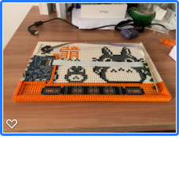
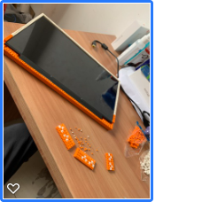
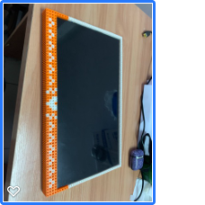
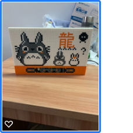
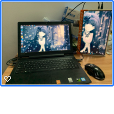

# DIY屏幕

我本来是想买一个屏幕的，也一直在看买哪种屏幕好，主要是我买了一个SWITCH，想用来放大一点玩游戏，也为以后自主装机时不用再去买一块屏幕，一举多得。但后来仔细一想，宿舍里我桌面上没什么空间放东西，也没插座，想了想就暂时算了，还是以后自己租房攒机时再买。但机缘巧合下我看到了DIY屏幕的教程，看了下效果很不错，于是我想来想去还是下单买了需要的材料，话不多说，DIY开始！

> 我看的教程是这篇
> 
> [如何低价DIY一个便携式显示器](https://zhuanlan.zhihu.com/p/143726050)
> 
> 我的屏幕是14寸 2k 100色域的，驱动板配套买的，花了￥500元，这是占大头的部分，
> 
> 积木我由于不确定要多少所以照着上面链接买的，￥120元，结果因为他是15.6寸屏幕，而且我没有把按键板放在边框，所以剩下10包白色积木2包橙色积木，不过我自觉成品是比他薄一点的（也相对减少了工作量）。
>
> 
> 东西是这周到的，人是今天走的。

> 
> 建议自己想尝试并且手上有屏幕的去淘宝买个驱动板，没有的就看自己意愿咯。

文章说了，本人也亲自体验过了，真的真的是非常需要耐心，而且积木拼多了手指头痛死了，大拇指和食指指缝的肉分离了一点点，痛了两天，而且估计还要痛下去，十指连心啊。。。

一小时的成果（由于刚拼积木不熟练），就拼了一个角。

一早上的成果，龙猫。

一天的成果，背板。

期间自己拼了一下自己的名字，由于黑色拼白色有点不好看而且黑色积木可能不够遂放弃，改用橙色。

开始放驱动板，往上叠边框，还得压实，太难了。

叠好边框放屏幕，前背板本来不想剪的结果试了一下会压到屏幕，还是乖乖剪吧（手好酸）。

终于终于在第二天完成了，也有空写下这篇文章记录了。

前面

后面

开机

哈哈哈，我的动手能力还是可以的嘛，咱今儿那叫一个高兴！